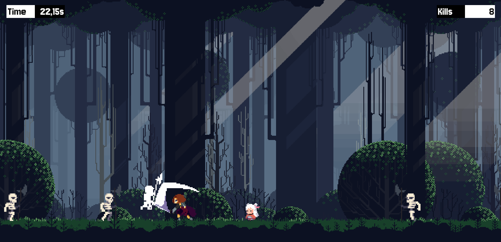

# My First Unity 2D Game
A simple 2D Unity game created to learn core engine features. Based on a YouTube [tutorial](https://www.youtube.com/watch?v=ZEtKg9AyEJc).

## Preview
[Play the game](https://play.unity.com/en/games/639dbd04-6ffe-4f37-bcac-e97bd502058f/tutorial-game-1)

## Notes
- fixed an issue where rapid attack input triggered two attack sequences instead of a single one

## Screenshots

